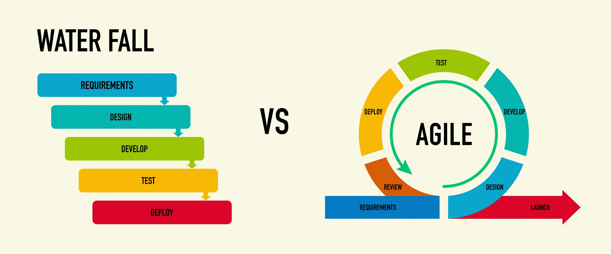

# Agile & Scrum Core

## 1. Agile Manifesto & Principles

Ra đời năm 2001, đây là nền tảng tư duy thay đổi cách thế giới **phát triển phần mềm**. Nó không phải quy tắc cứng nhắc mà là một "mindset" (tư duy) được xây dựng dựa trên 4 giá trị cốt lõi:

1. **Individuals & Interactions**
   Cá nhân và sự tương tác quan trọng hơn quy trình và công cụ.
2. **Working Software**
   Sản phẩm chạy tốt và quan trọng hơn tài liệu đầy đủ.
3. **Customer Collaboration**
   Cộng tác với khách hàng quan trọng hơn đàm phán hợp đồng.
4. **Responding to Change**
   Phản hồi với sự thay đổi quan trọng hơn bám sát kế hoạch.

Hiện tại, Agile được áp dụng rộng rãi trong nhiều domain khác nhau không chỉ mỗi phát triển phần mềm.

## 2. Scrum Roles, Events, and Artifacts deep-dive

Scrum là một **framework** quản lý công việc theo phương pháp Agile, thường dùng trong phát triển phần mềm để làm việc theo vòng lặp ngắn, linh hoạt và liên tục cải tiến.

Đơn vị cơ bản của Scrum là một đội nhỏ gọi là **Scrum Team**. Scrum Team bao gồm 01 Scrum Master, 01 Product Owner và các Developers.

Họ tự quyết định ai làm gì, khi nào và như thế nào?

1. **Product Owner:** Chịu trách nhiệm tối đa hóa giá trị của thành phẩm từ kết quả làm việc của Scrum Team.
2. **Scrum Master:** Chịu trách nhiệm triển khai Scrum.
3. **Developers:** Là những cá nhân trong Scrum Team cam kết tạo ra mọi thành phẩm của một Increment khả dụng sau mỗi Sprint.

### Scrum Events

**Sprint:** Các sprints đóng vai trò như nhịp tim đối với Scrum, trong đó, các ý tưởng được biến thành giá trị. Chúng là những sự kiện có độ dài nhất định (~1 tháng hoặc ngắn hơn).

**Sprint Planning:** Khởi đầu một Sprint bằng cách sắp đặt công việc sẽ được thực hiện trong Sprint. Sự kiện này giải quyết 3 câu hỏi lớn:

1. **WHY** (Tại sao Sprint mang lại giá trị?)
2. **WHAT** (Những gì có thể được hoàn tất?)
3. **HOW** (Làm thế nào để hoàn tất?)

**Daily Scrum:** Đây là sự kiện (~15 phút) dành cho các Developers của Scrum Team. Mục đích là để kiểm tra tiến độ hoàn thành Sprint Goal và thay đổi Sprint Backlog nếu cần.

**Sprint Review:** Sự kiện này để kiểm tra kết quả của Sprint và xác định những thích ứng trong tương lai.

**Sprint Retrospective:** Mục đích là để lập kế hoạch những cách tăng chất lượng và hiệu quả.

### Scrum Artifacts

Các thành phẩm của Scrum thể hiện công việc hoặc giá trị. Chúng được thiết kế để tối đa sự minh bạch của những thông tin chính yếu. Mỗi thành phẩm đi kèm một cam kết (ràng buộc).

**Product Backlog:** Đây là một danh sách có thứ tự, luôn tiến triển của những gì cần để cải tiến sản phẩm. Ràng buộc của Product Backlog là một **Product Goal**.

**Sprint Backlog:** Bao gồm **Sprint Goal**, tập các hạng mục chọn từ Product Backlog và kế hoạch hành động. Ràng buộc của Sprint Backlog là **Sprint Goal**.

**Increment:** Một Increment là một bước đệm vững chắc hướng tới Product Goal. Ràng buộc của Increment là **Định nghĩa về sự hoàn tất (Definition of Done)**.

## 3. Mô hình Waterfall và Agile

**Waterfall:** Là mô hình phát triển phần mềm truyền thống tuyến tính. Các giai đoạn (Lấy yêu cầu, Thiết kế, Lập trình, Kiểm thử, Triển khai) diễn ra tuần tự từ trên xuống dưới. Giai đoạn sau chỉ bắt đầu khi giai đoạn trước **hoàn tất**. Nếu có lỗi ở cuối quy trình, việc quay lại sửa rất tốn kém.

**Agile:** Chia dự án thành các chu kỳ nhỏ (như Sprint trong Scrum). Mỗi chu kỳ đều trải qua các bước từ ý tưởng đến kiểm thử cho ra sản phẩm dùng được ngay. Dễ dàng thích ứng nếu có yêu cầu thay đổi.

## 4. Gherkin Syntax

Gherkin là một ngôn ngữ đọc hiểu cho cả con người (khách hàng, đội kinh doanh) và máy tính (đội kỹ thuật). Cú pháp này thường được dùng để viết **User Stories** trong phương pháp **BDD (Behavior-Driven Development)**. Nó mô tả hành vi của hệ thống theo cấu trúc gồm 3 phần:

1. **Given (Giả định):** Trạng thái hoặc ngữ cảnh ban đầu của hệ thống.
2. **When (Khi):** Hành động kích sự kiện.
3. **Then (Thì):** Kết quả mong đợi sau hành động đó.
