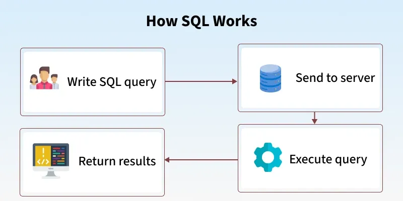
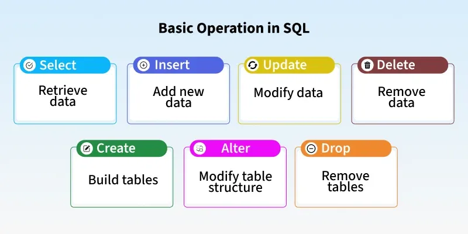
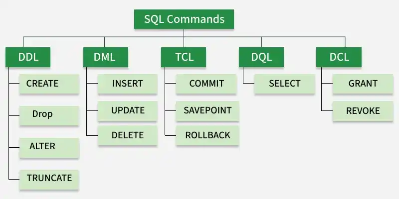

<!-- Gộp nội dung từ: structured-&-unstructured-data.md -->
# Structured & Unstructured Data

## 1. Dữ liệu có cấu trúc (Structured Data)

### Định nghĩa

Dữ liệu có cấu trúc (Structured Data) là dữ liệu được tổ chức, định dạng và lưu trữ theo một lược đồ (schema) xác định trước. Dữ liệu này tuân theo một định dạng cố định với các hàng (rows) và cột (columns) rõ ràng, trong đó mỗi trường dữ liệu có một loại dữ liệu (data type) và ý nghĩa (semantic) cụ thể.

**Đặc điểm chính:**

- **Có lược đồ (Schema-based)**: Cấu trúc dữ liệu được định nghĩa rõ ràng trước khi nhập dữ liệu.
- **Định dạng cố định**: Mỗi bản ghi phải tuân thủ cấu trúc được định sẵn.
- **Dễ truy vấn**: Có thể truy vấn bằng SQL hoặc các ngôn ngữ truy vấn tiêu chuẩn.
- **Bảng (Tabular)**: Dữ liệu được sắp xếp thành các bảng với hàng và cột rõ ràng.

### Ví dụ về Dữ liệu có cấu trúc

```
Bảng Employee:
| emp_id | emp_name      | emp_salary | hire_date  | department |
|--------|---------------|------------|------------|-----------|
| 1      | Nguyễn Văn A  | 50,000,000 | 2023-01-15 | IT        |
| 2      | Trần Thị B    | 45,000,000 | 2023-03-20 | HR        |
| 3      | Phạm Văn C    | 55,000,000 | 2022-06-10 | Sales     |
```

Các ví dụ khác:

- **Bảng trong cơ sở dữ liệu quan hệ**: MySQL, PostgreSQL, Oracle, SQL Server
- **Dữ liệu CSV**: Dữ liệu bảng tính được lưu dưới dạng văn bản phân tách bằng dấu phẩy
- **Dữ liệu Excel**: Các tệp bảng tính có định dạng cột rõ ràng
- **Dữ liệu thời gian thực từ IoT**: Dữ liệu từ các cảm biến với các trường xác định trước

### Ưu điểm của Dữ liệu có cấu trúc

- **Dễ tìm kiếm và truy vấn**: SQL và các công cụ truy vấn khác có thể dễ dàng truy cập dữ liệu.
- **Tính nhất quán cao**: Dữ liệu tuân theo quy tắc dữ liệu (data validation rules) và ràng buộc.
- **Hiệu suất tốt**: Truy vấn trên dữ liệu có cấu trúc thường nhanh hơn.
- **Quản lý dễ dàng**: Dữ liệu được tổ chức rõ ràng, dễ bảo trì và cập nhật.
- **Tích hợp tốt**: Dễ dàng tích hợp giữa các hệ thống khác nhau.

### Nhược điểm của Dữ liệu có cấu trúc

- **Độ cứng nhắc cao**: Khó thay đổi cấu trúc sau khi đã tạo, thêm cột mới có thể tốn nhiều thời gian.
- **Không phù hợp với dữ liệu đa dạng**: Không phù hợp lưu trữ dữ liệu có cấu trúc khác nhau.
- **Khó mở rộng ngang**: Khó chia sẻ dữ liệu trên nhiều máy chủ.
- **Tốn dung lượng**: Dữ liệu bị ràng buộc bởi lược đồ có thể tốn nhiều không gian lưu trữ.

## 2. Dữ liệu phi cấu trúc (Unstructured Data)

### Định nghĩa

Dữ liệu phi cấu trúc (Unstructured Data) là dữ liệu không tuân theo bất kỳ định dạng, lược đồ hoặc cấu trúc cụ thể nào. Đây là dữ liệu tự do (free-form), không có định dạng cột hay hàng rõ ràng, và thường chứa thông tin phức tạp như văn bản, hình ảnh, âm thanh, và video.

**Đặc điểm chính:**

- **Không có lược đồ (Schema-less)**: Dữ liệu không cần tuân thủ một cấu trúc được định sẵn.
- **Định dạng tự do**: Mỗi bản ghi có thể có cấu trúc khác nhau.
- **Khó truy vấn**: Truy vấn yêu cầu các kỹ thuật xử lý dữ liệu phức tạp hơn (NLP, Computer Vision).
- **Đa dạng loại dữ liệu**: Bao gồm văn bản, hình ảnh, âm thanh, video, và các định dạng khác.

### Ví dụ về Dữ liệu phi cấu trúc

```
Tài liệu văn bản (Text):
"Hôm nay là một ngày đẹp trời. Tôi đã đi học và học được rất nhiều điều hay.
Sự học tập là rất quan trọng cho sự phát triển của con người."

Dữ liệu JSON (bán cấu trúc):
{
  "user_id": 123,
  "name": "Nguyễn Văn A",
  "posts": [
    {
      "id": 1,
      "title": "Bài viết đầu tiên",
      "comments_count": 5,
      "tags": ["tech", "ai"]
    }
  ],
  "profile": {
    "bio": "Data Engineer",
    "followers": 1500
  }
}

Hình ảnh (Image): photo.jpg, logo.png
Âm thanh (Audio): podcast.mp3, voice_message.wav
Video (Video): tutorial.mp4, presentation.mkv
```

Các ví dụ khác:

- **Email và tin nhắn**: Không có cấu trúc cố định
- **Bài đăng trên mạng xã hội**: Văn bản, hình ảnh, video, emoji được trộn lẫn
- **Tài liệu PDF**: Có định dạng phức tạp
- **Dữ liệu từ cảm biến (sensor data)**: Có thể có khoảng trống hoặc dữ liệu bị thiếu
- **Log từ ứng dụng**: Không có cấu trúc nhất quán

### Ưu điểm của Dữ liệu phi cấu trúc

- **Linh hoạt cao**: Dễ thêm, xóa, hoặc thay đổi các trường dữ liệu.
- **Phù hợp với nhiều loại dữ liệu**: Có thể lưu trữ bất kỳ loại dữ liệu nào.
- **Phát triển nhanh**: Không cần định nghĩa lược đồ trước, có thể bắt đầu lưu trữ dữ liệu ngay lập tức.
- **Mở rộng tốt**: Dễ mở rộng theo chiều ngang trên nhiều máy chủ (horizontal scaling).
- **Phù hợp với Big Data**: Có thể xử lý lượng dữ liệu khổng lồ hiệu quả.

### Nhược điểm của Dữ liệu phi cấu trúc

- **Khó truy vấn**: Yêu cầu các kỹ thuật xử lý dữ liệu tiên tiến để trích xuất thông tin hữu ích.
- **Tính nhất quán thấp**: Dữ liệu có thể không đồng nhất, gây khó khăn trong phân tích.
- **Khó quản lý**: Không có quy tắc dữ liệu, dễ dẫn đến chất lượng dữ liệu kém.
- **Tiêu tốn dung lượng**: Dữ liệu phi cấu trúc thường chiếm nhiều không gian lưu trữ hơn.
- **Hiệu suất truy vấn thấp**: Truy vấn trên dữ liệu phi cấu trúc thường chậm hơn dữ liệu có cấu trúc.

## 3. So sánh giữa Dữ liệu có cấu trúc và Dữ liệu phi cấu trúc

| Tiêu chí           | Structured Data            | Unstructured Data                      |
| :----------------- | :------------------------- | :------------------------------------- |
| **Lược đồ**        | Có lược đồ xác định trước  | Không có lược đồ (schema-less)         |
| **Định dạng**      | Cố định, tuân thủ cấu trúc | Tự do, không có cấu trúc nhất quán     |
| **Tổ chức**        | Bảng, hàng, cột rõ ràng    | Không có tổ chức hình thức             |
| **Kích thước**     | Thường nhỏ hơn             | Thường lớn hơn (chiếm ~80-90% dữ liệu) |
| **Truy vấn**       | Dễ truy vấn bằng SQL       | Khó truy vấn, cần kỹ thuật tiên tiến   |
| **Hiệu suất**      | Truy vấn nhanh             | Truy vấn chậm                          |
| **Tính nhất quán** | Cao                        | Thấp                                   |
| **Linh hoạt**      | Thấp, khó thay đổi         | Cao, dễ thay đổi                       |
| **Mở rộng**        | Khó mở rộng ngang          | Dễ mở rộng ngang                       |
| **Công cụ**        | SQL, RDBMS                 | NoSQL, MongoDB, Hadoop, Spark          |
| **Ứng dụng**       | ERP, CRM, Banking          | Social Media, Images, Videos           |

## 4. Dữ liệu bán cấu trúc (Semi-structured Data)

### Định nghĩa

Dữ liệu bán cấu trúc (Semi-structured Data) là dữ liệu nằm giữa dữ liệu có cấu trúc và dữ liệu phi cấu trúc. Dữ liệu này không tuân theo lược đồ RDBMS cố định nhưng có các thẻ (tags) hoặc nhãn (labels) để tổ chức thông tin.

## 5. Các định dạng tệp phổ biến (Common File Formats)

### 5.1 JSON (JavaScript Object Notation)

#### Định nghĩa

JSON là một định dạng trao đổi dữ liệu văn bản nhẹ (lightweight), dễ đọc bởi con người và máy tính. JSON được phát triển vào năm 2002 và trở thành tiêu chuẩn phổ biến cho việc truyền dữ liệu giữa các máy chủ web và trình duyệt, cũng như giữa các API.

#### Cấu trúc

JSON sử dụng hai cấu trúc chính:

**1. Object (Đối tượng)** - Bắt đầu bằng `{` và kết thúc bằng `}`

```json
{
  "key1": "value1",
  "key2": 123,
  "key3": true,
  "key4": null
}
```

**2. Array (Mảng)** - Bắt đầu bằng `[` và kết thúc bằng `]`

```json
["item1", "item2", 123, true]
```

**Kiểu dữ liệu trong JSON:**

- **String**: `"hello"` - Chuỗi ký tự bọc trong dấu ngoặc kép
- **Number**: `123`, `45.67` - Số nguyên hoặc số thập phân
- **Boolean**: `true`, `false` - Giá trị logic
- **Null**: `null` - Giá trị không tồn tại
- **Object**: `{}` - Tập hợp các key-value pairs
- **Array**: `[]` - Danh sách các giá trị

#### Ví dụ thực tế

```json
{
  "customer_id": "C001",
  "name": "Nguyễn Văn A",
  "email": "nguyenvana@example.com",
  "phone": "0901234567",
  "is_active": true,
  "registration_date": "2023-01-15",
  "orders": [
    {
      "order_id": "O001",
      "date": "2024-01-15",
      "items": [
        {
          "product_id": "P001",
          "product_name": "Laptop",
          "quantity": 1,
          "price": 20000000
        },
        {
          "product_id": "P002",
          "product_name": "Mouse",
          "quantity": 2,
          "price": 500000
        }
      ],
      "total": 21000000,
      "status": "completed"
    }
  ],
  "address": {
    "street": "123 Đường Nguyễn Huệ",
    "city": "Hồ Chí Minh",
    "district": "Quận 1",
    "postal_code": "70000",
    "country": "Vietnam"
  }
}
```

#### Ưu điểm

- **Nhẹ và nhanh**: Kích thước tệp nhỏ, xử lý nhanh
- **Dễ đọc**: Con người dễ hiểu cấu trúc
- **Hỗ trợ rộng rãi**: Hầu hết ngôn ngữ lập trình đều hỗ trợ
- **Linh hoạt**: Có thể lồng các object và array vô hạn
- **Chuẩn công nghiệp**: Được sử dụng rộng rãi trong web APIs

#### Nhược điểm

- **Không hỗ trợ comment**: Không thể thêm ghi chú trong JSON
- **Không hỗ trợ ngày tháng**: Phải lưu ngày tháng dưới dạng string
- **Không có schema mặc định**: Cần xác định schema riêng (JSON Schema)

#### Ứng dụng

- **REST APIs**: Trao đổi dữ liệu giữa client và server
- **Cấu hình ứng dụng**: package.json (Node.js), config.json
- **NoSQL Databases**: MongoDB lưu trữ dữ liệu dạng JSON
- **Real-time Data**: WebSocket, Server-Sent Events
- **Web Scraping**: Lưu trữ dữ liệu từ trang web

---

### 5.2 CSV (Comma-Separated Values)

#### Định nghĩa

CSV là định dạng tệp văn bản đơn giản để lưu trữ dữ liệu bảng tính (tabular data). Mỗi dòng trong tệp CSV đại diện cho một hàng, và các giá trị được phân tách bằng dấu phẩy. CSV là định dạng phổ biến nhất để trao đổi dữ liệu giữa các ứng dụng khác nhau.

#### Cấu trúc

```csv
column1,column2,column3,column4
value1,value2,value3,value4
value5,value6,value7,value8
```

**Các quy tắc:**

- **Hàng đầu tiên (Header)**: Chứa tên cột (không bắt buộc nhưng được khuyến cáo)
- **Các hàng tiếp theo**: Chứa dữ liệu bảng tính
- **Dấu phân tách mặc định**: Dấu phẩy (`,`), nhưng có thể là `;` hoặc `\t` (tab)
- **Trích dẫn (Quoting)**: Nếu giá trị chứa dấu phẩy, cần bọc trong ngoặc kép: `"value, with comma"`

#### Ví dụ thực tế

```csv
emp_id,emp_name,email,phone,department,salary,hire_date
E001,Nguyễn Văn A,nguyenvana@example.com,0901234567,IT,50000000,2023-01-15
E002,Trần Thị B,tranthib@example.com,0909876543,HR,45000000,2023-03-20
E003,Phạm Văn C,phamvanc@example.com,0912345678,Sales,55000000,2022-06-10
E004,"Lê Thị D (Team Lead)",leqthid@example.com,0913579246,IT,60000000,2021-11-05
```

**Cách xử lý giá trị phức tạp:**

Nếu giá trị chứa dấu phẩy hoặc dòng mới, phải bọc trong ngoặc kép:

```csv
customer_id,name,address
C001,Nguyễn Văn A,"123 Đường Nguyễn Huệ, Quận 1"
C002,Trần Thị B,"456 Đường Lê Lợi, Quận 1"
C003,Phạm Văn C,"789 Đường Trần Hưng Đạo
Quận 5"
```

#### Ưu điểm

- **Đơn giản và nhẹ**: Kích thước tệp nhỏ, dễ xử lý
- **Hỗ trợ phổ quát**: Mọi ứng dụng bảng tính đều hỗ trợ (Excel, Google Sheets, v.v.)
- **Dễ đọc**: Con người có thể mở và dọc trực tiếp
- **Không phụ thuộc công cụ**: Có thể xử lý bằng bất kỳ ngôn ngữ lập trình nào
- **Hỗ trợ big data**: Có thể xử lý tệp lớn giống như Hadoop, Spark

#### Nhược điểm

- **Không có schema**: Không có định dạng chuẩn để định nghĩa kiểu dữ liệu
- **Khó xử lý dữ liệu phức tạp**: Không thể lồng cấu trúc
- **Không hỗ trợ metadata**: Chỉ là bảng phẳng
- **Ambiguity**: Cần thỏa thuận về dấu phân tách, quoting, và encoding
- **Không an toàn khi có dấu phẩy**: Cần escape cẩn thận

#### Ứng dụng

- **Nhập/xuất dữ liệu**: Từ Excel, Google Sheets, Airtable
- **Data Analytics**: Tệp dữ liệu đầu vào cho Pandas (Python), R
- **ETL Processes**: Tệp trung gian trong quy trình xử lý dữ liệu
- **Trao đổi dữ liệu B2B**: Các phần mềm quản lý khác nhau
- **Machine Learning Datasets**: Tập dữ liệu huấn luyện mô hình
- **Log files**: Một số ứng dụng xuất log dưới dạng CSV

### 5.3 So sánh JSON, XML, CSV

| Tiêu chí                  | JSON                               | XML                     | CSV                    |
| :------------------------ | :--------------------------------- | :---------------------- | :--------------------- |
| **Kích thước tệp**        | Nhỏ                                | Lớn                     | Rất nhỏ                |
| **Khả năng đọc**          | Tốt                                | Tốt                     | Rất tốt                |
| **Hỗ trợ lồng (Nesting)** | Có (Object/Array)                  | Có (Elements)           | Không                  |
| **Schema**                | JSON Schema (optional)             | XML Schema (XSD)        | Không có               |
| **Kiểu dữ liệu**          | Có (string, number, boolean, null) | Tất cả đều string       | Tất cả đều string      |
| **Comment**               | Không                              | Có (`<!-- comment -->`) | Không                  |
| **Namespace**             | Không                              | Có                      | Không                  |
| **Tốc độ xử lý**          | Nhanh                              | Chậm                    | Rất nhanh              |
| **Sử dụng phổ biến**      | APIs, NoSQL                        | SOAP, Enterprise        | Excel, Data Import     |
| **Ví dụ use case**        | REST API response                  | SOAP Web Service        | CSV export từ database |

### 5.4 Lựa chọn định dạng nào?

**Chọn JSON khi:**

- Xây dựng REST API
- Làm việc với Node.js, Python, JavaScript
- Cần tốc độ xử lý nhanh
- Dữ liệu có cấu trúc phức tạp (nested)

**Chọn XML khi:**

- Xây dựng SOAP Web Services
- Cần schema chặt chẽ (XML Schema)
- Làm việc với các hệ thống enterprise
- Cần namespace để tránh xung đột
- Cần hỗ trợ công cụ chuẩn (XSLT, XPath)

**Chọn CSV khi:**

- Trao đổi dữ liệu với Excel/Google Sheets
- Dữ liệu bảng tính đơn giản
- Cần kích thước tệp nhỏ nhất có thể
- Dễ dàng import/export
- Thực hiện phân tích dữ liệu

## 6. Ứng dụng trong Data Engineering

### Dữ liệu có cấu trúc (Structured Data)

- **Hệ thống quản lý**: ERP, CRM, HRM
- **Giao dịch tài chính**: Banking, Payment systems
- **Báo cáo kinh doanh**: Analytics, Business Intelligence
- **Quản lý kho dữ liệu**: Data Warehouse, Data Mart
- **IoT có định dạng cố định**: Dữ liệu cảm biến với các trường xác định

### Dữ liệu phi cấu trúc (Unstructured Data)

- **Mạng xã hội**: Facebook, Instagram, TikTok - chứa hình ảnh, video, văn bản
- **Nội dung kỹ thuật số**: Blog, News, Wikipedia
- **Multimedia**: Thư viện hình ảnh, video
- **Email và tin nhắn**: Giao tiếp trong tổ chức
- **Log và Monitoring**: System logs, Application logs, Sensor logs

### Dữ liệu bán cấu trúc (Semi-structured Data)

- **API responses**: Dữ liệu JSON từ các API web
- **Web scraping**: Dữ liệu HTML được lấy từ trang web
- **Dữ liệu IoT**: Thường ở định dạng JSON hoặc CSV
- **Document databases**: MongoDB, Elasticsearch lưu trữ dữ liệu bán cấu trúc

## 7. Công cụ và Công nghệ

### Cho Dữ liệu có cấu trúc

| Công cụ            | Mô tả                                                             |
| :----------------- | :---------------------------------------------------------------- |
| **RDBMS**          | MySQL, PostgreSQL, Oracle, SQL Server - Cơ sở dữ liệu quan hệ     |
| **SQL**            | Ngôn ngữ chuẩn để truy vấn dữ liệu có cấu trúc                    |
| **ETL Tools**      | Talend, Informatica, Apache NiFi - để xử lý và chuyển đổi dữ liệu |
| **Data Warehouse** | Snowflake, Amazon Redshift, Google BigQuery                       |
| **BI Tools**       | Tableau, Power BI, Looker - để tạo báo cáo và dashboard           |

### Cho Dữ liệu phi cấu trúc

| Công cụ                | Mô tả                                                |
| :--------------------- | :--------------------------------------------------- |
| **NoSQL Databases**    | MongoDB, Cassandra, HBase - Cơ sở dữ liệu NoSQL      |
| **Big Data Platforms** | Hadoop, Apache Spark - Xử lý dữ liệu lớn             |
| **Cloud Storage**      | Amazon S3, Azure Blob, Google Cloud Storage          |
| **Machine Learning**   | TensorFlow, PyTorch - Xử lý hình ảnh, video, văn bản |
| **Text Processing**    | NLP, Elasticsearch - Tìm kiếm toàn văn bản           |

### Cho Dữ liệu bán cấu trúc

| Công cụ                | Mô tả                             |
| :--------------------- | :-------------------------------- |
| **Document Databases** | MongoDB, CouchDB, Elasticsearch   |
| **Data Serialization** | JSON, XML, Protocol Buffers       |
| **ETL Platforms**      | Apache NiFi, Talend, Apache Beam  |
| **Data Lakes**         | Cloud storage với xử lý tùy chỉnh |

## 8. Thách thức và Giải pháp

### Thách thức

**Dữ liệu có cấu trúc:**

- Khó thích nghi với thay đổi yêu cầu kinh doanh
- Giới hạn trong lưu trữ dữ liệu đa dạng

**Dữ liệu phi cấu trúc:**

- Khó xử lý và phân tích
- Yêu cầu công nghệ tiên tiến và kỹ năng chuyên môn cao
- Chất lượng dữ liệu không ổn định

### Giải pháp

- **Data Lake**: Lưu trữ cả dữ liệu có cấu trúc, bán cấu trúc, và phi cấu trúc ở một nơi
- **Hybrid Approach**: Sử dụng kết hợp RDBMS và NoSQL tùy theo nhu cầu
- **Data Governance**: Thiết lập quy tắc, tiêu chuẩn, và quy trình quản lý dữ liệu
- **Master Data Management (MDM)**: Quản lý dữ liệu chính một cách tập trung

## 9. Xu hướng trong Data Engineering

- **Data Mesh**: Phân tán quản lý dữ liệu cho các đội riêng lẻ
- **Real-time Streaming**: Xử lý dữ liệu thời gian thực từ các nguồn không cấu trúc
- **AI/ML Integration**: Sử dụng AI/ML để xử lý và phân tích dữ liệu phi cấu trúc
- **Data Lakehouse**: Kết hợp tốt nhất của Data Lake và Data Warehouse
- **GraphQL APIs**: Truy cập dữ liệu bán cấu trúc một cách linh hoạt

---

## Tài liệu tham khảo

- GeeksforGeeks. (2024). _Structured vs Unstructured Data_. Truy cập từ https://www.geeksforgeeks.org
- IBM. (2024). _Structured vs Unstructured Data_. IBM Cloud Education.
- Databricks. (2024). _Lakehouse Architecture_. Truy cập từ https://databricks.com


---

<!-- Gộp nội dung từ: sql-nosql.md -->
# SQL & NoSQL Fundamentals

## SQL (Structured Query Language)

SQL là ngôn ngữ tiêu chuẩn được sử dụng để tương tác, quản lý và truy vấn dữ liệu từ cơ sở dữ liệu quan hệ (Relational Database Management System - RDBMS). SQL hỗ trợ các hoạt động CRUD (Create, Read, Update, Delete) và được hỗ trợ rộng rãi trên nhiều hệ thống CSDL khác nhau như MySQL, Oracle, PostgreSQL, SQL Server, MariaDB, và các hệ thống khác. SQL primary hoạt động với dữ liệu được sắp xếp theo cấu trúc bảng (table-structured data) trong cơ sở dữ liệu quan hệ.



### 1. Một vài thao tác đặc trưng trong SQL.



### 2. Các bước chi tiết liên quan đến truy vấn SQL

Quy trình xử lý một truy vấn SQL diễn ra theo các bước sau:

- **Input (Tiếp nhận)**: Người dùng gửi truy vấn SQL (SELECT, INSERT, UPDATE, DELETE, v.v.).
- **Phân tích cú pháp (Parsing)**: Hệ thống kiểm tra xem truy vấn có tuân theo cấu trúc cú pháp SQL chính xác hay không.
- **Xác thực ngữ cảnh (Validation)**: Kiểm tra sự tồn tại của các bảng, cột và các quyền truy cập của người dùng.
- **Tối ưu hóa (Optimization)**: Query Optimizer phân tích các cách khác nhau để thực hiện truy vấn và chọn ra kế hoạch thực hiện hiệu quả nhất.
- **Biên dịch (Compilation)**: Chuyển đổi truy vấn đã tối ưu thành mã máy.
- **Thực thi (Execution)**: CSDL chạy truy vấn theo kế hoạch thực hiện đã được chọn.
- **Đầu ra (Output)**: Kết quả hoặc xác nhận gửi lại cho người dùng.

### 3. Quy tắc viết truy vấn SQL

**Cú pháp cơ bản:**

- **Dấu chấm phẩy ";"**: Kết thúc một câu lệnh SQL.
- **Không phân biệt chữ hoa chữ thường**: Các từ khóa SQL như SELECT, INSERT, UPDATE, DELETE không phân biệt chữ hoa hay chữ thường, tuy nhiên thường được viết in hoa để dễ nhận diện.
- **Khoảng trắng**: Khoảng trắng và dòng mới được phép để tăng tính dễ đọc của mã.
- **Bình luận (Comment)**:
  - Một dòng: `-- comment`
  - Nhiều dòng: `/* comment */`

**Định danh (Identifiers - Tên đối tượng):**

- Bắt đầu bằng một chữ cái (A-Z, a-z)
- Chứa chữ cái, số (0-9) hoặc dấu gạch dưới (\_)
- Độ dài tối đa tùy thuộc vào từng CSDL (thường từ 64 đến 300 ký tự)
- Để sử dụng từ khóa SQL làm tên đối tượng, phải đặt trong dấu ngoặc kép hoặc backtick: `SELECT`, `"user"`, `table`

**Giá trị dữ liệu:**

- **Chuỗi ký tự (String)**: Đặt trong dấu ngoặc kép đơn: `'Hello World'`
- **Số (Number)**: Không cần dấu ngoặc: `123`, `45.67`
- **NULL**: Biểu thị giá trị không tồn tại

**Ràng buộc (Constraints):**

- Sử dụng các ràng buộc như `NOT NULL`, `UNIQUE`, `PRIMARY KEY`, `FOREIGN KEY`, `CHECK` để đảm bảo tính toàn vẹn và nhất quán của dữ liệu.

### 4. Các lệnh truy vấn SQL

Các lệnh SQL được phân loại thành năm danh mục chính dựa trên chức năng cụ thể của chúng. Mỗi danh mục có những lệnh riêng để quản lý, truy vấn, và bảo vệ dữ liệu trong cơ sở dữ liệu:



**1. Data Definition Language (DDL)**

DDL bao gồm các lệnh được sử dụng để định nghĩa, tạo, thay đổi hoặc xóa cấu trúc của các đối tượng trong cơ sở dữ liệu (bảng, view, index, schema, v.v.).

| Command  | Description                                                                        |
| :------: | :--------------------------------------------------------------------------------- |
|  CREATE  | Tạo các đối tượng CSDL mới như bảng, view, index, schema, hoặc stored procedure.   |
|  ALTER   | Sửa đổi cấu trúc của các đối tượng có sẵn (thêm/xóa cột, thay đổi kiểu dữ liệu).   |
|   DROP   | Xóa hoàn toàn một đối tượng CSDL (bảng, view, index) cùng dữ liệu của nó.          |
| TRUNCATE | Xóa toàn bộ dữ liệu từ một bảng nhưng giữ nguyên cấu trúc bảng (nhanh hơn DELETE). |
|  RENAME  | Đổi tên cho một đối tượng CSDL (bảng, cột, view).                                  |

**2. Data Manipulation Language (DML)**

DML bao gồm các lệnh được sử dụng để thêm, cập nhật, xóa, và truy xuất dữ liệu từ các bảng trong cơ sở dữ liệu quan hệ.

| Command | Description                                                              |
| :-----: | :----------------------------------------------------------------------- |
| INSERT  | Thêm một hoặc nhiều bản ghi mới vào bảng.                                |
| UPDATE  | Cập nhật giá trị của một hoặc nhiều cột trong bản ghi hiện có.           |
| DELETE  | Xóa một hoặc nhiều bản ghi từ bảng dựa trên điều kiện WHERE.             |
| SELECT  | Truy vấn và lấy dữ liệu từ một hoặc nhiều bảng (có thể được coi là DQL). |

**3. Data Query Language (DQL)**

DQL là một thành phần của SQL tập trung vào việc truy xuất dữ liệu từ cơ sở dữ liệu bằng lệnh **SELECT**. DQL cho phép người dùng chỉ định chính xác dữ liệu nào cần lấy, từ bảng nào, và dữ liệu đó sẽ được lọc, sắp xếp, và nhóm như thế nào.

**Đặc điểm chính:**

- **Truy vấn dữ liệu**: DQL được sử dụng độc quyền để truy xuất dữ liệu, không thay đổi nội dung CSDL.
- **Điều kiện lọc**: Sử dụng mệnh đề `WHERE` để áp dụng các điều kiện cụ thể khi truy vấn.
- **Sắp xếp và nhóm**: Sử dụng `ORDER BY`, `GROUP BY` để sắp xếp và nhóm kết quả.
- **Toán tử quan hệ**: Hỗ trợ các toán tử so sánh (=, <>, <, >, <=, >=), logic (AND, OR, NOT), v.v.

**Ví dụ cơ bản:**

```SQL
-- Truy vấn tất cả bản ghi từ bảng employee
SELECT * FROM employee;

-- Truy vấn các cột cụ thể với điều kiện
SELECT emp_name, emp_salary FROM employee WHERE emp_salary > 5000;

-- Truy vấn với sắp xếp
SELECT * FROM employee ORDER BY emp_salary DESC;
```

Dấu `*` trong SELECT cho biết rằng tất cả các cột được truy vấn từ bảng.

**4. Data Control Language (DCL)**

DCL bao gồm các lệnh được sử dụng để quản lý quyền truy cập của người dùng đối với các đối tượng CSDL. DCL đảm bảo an toàn và bảo mật dữ liệu bằng cách kiểm soát ai có thể làm gì với dữ liệu.

| Command | Description                                                      |
| :-----: | :--------------------------------------------------------------- |
|  GRANT  | Cấp quyền (SELECT, INSERT, UPDATE, DELETE, v.v.) cho người dùng. |
| REVOKE  | Thu hồi quyền đã cấp từ người dùng.                              |

**Ví dụ:**

```sql
GRANT SELECT, INSERT ON table_name TO user_name;
REVOKE DELETE ON table_name FROM user_name;
```

**5. Transaction Control Language (TCL)**

TCL bao gồm các lệnh được sử dụng để quản lý các transaction trong CSDL quan hệ. Transaction là một chuỗi các hoạt động (một hoặc nhiều lệnh SQL) được thực hiện như một đơn vị logic duy nhất, tuân theo nguyên tắc ACID (Atomicity, Consistency, Isolation, Durability) để đảm bảo tính toàn vẹn và nhất quán của dữ liệu.

|  Command  | Description                                                                                          |
| :-------: | :--------------------------------------------------------------------------------------------------- |
|  COMMIT   | Xác nhận và lưu vĩnh viễn tất cả những thay đổi trong transaction hiện tại.                          |
| ROLLBACK  | Hủy bỏ tất cả những thay đổi trong transaction hiện tại và khôi phục dữ liệu về trạng thái trước đó. |
| SAVEPOINT | Tạo một điểm lưu giữa trong transaction để có thể rollback về điểm đó mà không ảnh hưởng toàn bộ.    |

**Ví dụ:**

```sql
BEGIN TRANSACTION;
    INSERT INTO account VALUES (1, 'John', 1000);
    UPDATE account SET balance = balance - 500 WHERE id = 1;
    SAVEPOINT sp1;
    UPDATE account SET balance = balance + 500 WHERE id = 2;
COMMIT;  -- Lưu tất cả thay đổi

-- Nếu có lỗi
ROLLBACK TO SAVEPOINT sp1;  -- Quay lại điểm sp1
ROLLBACK;  -- Quay lại trước khi BEGIN
```

### 5. Ưu điểm và nhược điểm của SQL

**a. Ưu điểm**

- **Hiệu suất cao**: SQL được tối ưu hóa tốt cho các truy vấn phức tạp trên dữ liệu có cấu trúc.
- **Tính khả dụng rộng**: Được hỗ trợ trên hầu hết các hệ thống RDBMS, giúp dễ dàng chuyển đổi giữa các nền tảng khác nhau.
- **Tính mở rộng**: SQL có thể làm việc hiệu quả từ dữ liệu nhỏ đến dữ liệu rất lớn (Big Data).
- **Hỗ trợ xử lý logic phức tạp**: Có các tiện ích mở rộng như PL/SQL (Oracle), T-SQL (SQL Server), PL/pgSQL (PostgreSQL) để viết các logic phức tạp.
- **Tính toàn vẹn dữ liệu**: Ràng buộc (constraints), transactions, và khóa (locking) đảm bảo dữ liệu luôn nhất quán.

**b. Nhược điểm**

- **Cấu trúc cứng nhắc**: Dữ liệu phải tuân thủ lược đồ (schema) được định sẵn, khó thích nghi với các thay đổi.
- **Không phù hợp với dữ liệu phi cấu trúc**: SQL không tối ưu cho dữ liệu không có cấu trúc hoặc bán cấu trúc (hình ảnh, video, tài liệu JSON).
- **Độ trễ xử lý**: Các hoạt động phức tạp như tối ưu hóa và xác thực có thể tạo độ trễ.
- **Khó mở rộng theo chiều ngang (Horizontal Scaling)**: Các RDBMS truyền thống khó chia sẻ dữ liệu trên nhiều máy chủ.
- **Không hỗ trợ Real-time Analytics tốt**: SQL truyền thống không được thiết kế cho phân tích dữ liệu thời gian thực với khối lượng dữ liệu cực lớn.

### 6. Ứng dụng của SQL

SQL được sử dụng rộng rãi trong nhiều lĩnh vực khác nhau:

- **Data Analytics (Phân tích dữ liệu)**: Truy vấn, phân tích, và báo cáo dữ liệu lớn từ nhiều nguồn khác nhau.
- **E-Commerce (Thương mại điện tử)**: Quản lý hồ sơ khách hàng, danh mục sản phẩm, đơn hàng, thanh toán, và hàng tồn kho.
- **Backend Development (Phát triển Backend)**: Lưu trữ và quản lý dữ liệu ứng dụng web, API, và các dịch vụ.
- **Business Intelligence (Thông tin kinh doanh)**: Tạo báo cáo, dashboard, và insight từ dữ liệu kinh doanh.
- **Finance (Tài chính)**: Quản lý tài khoản, giao dịch, phân tích lịch sử tài chính, báo cáo thuế, và kiểm soán rủi ro.
- **Healthcare (Sức khỏe)**: Quản lý hồ sơ bệnh án điện tử (EHR), lịch hẹn, kết quả xét nghiệm, và lịch sử điều trị.

## NoSQL (Not Only SQL)

NoSQL là một thuật ngữ đại diện cho một loại cơ sở dữ liệu đa dạng không sử dụng mô hình dữ liệu quan hệ dạng bảng truyền thống (như SQL). Thay vào đó, NoSQL được thiết kế linh hoạt để xử lý các loại dữ liệu từ phi cấu trúc, bán cấu trúc đến có cấu trúc lớn, có tốc độ thay đổi cao và đòi hỏi xử lý nhanh. "Not Only SQL" mang ý nghĩa rằng đôi khi hệ thống này có thể hỗ trợ/kết hợp thêm các ngôn ngữ truy vấn giống SQL, nhưng bản chất không phụ thuộc hoàn toàn vào nó.

### 1. Phân loại cơ sở dữ liệu NoSQL

Khác với SQL chủ yếu là dạng bảng, NoSQL cung cấp nhiều mô hình lưu trữ khác nhau để tối ưu hóa cho từng kiến trúc:

- **Key-Value Store**: Lưu trữ dữ liệu dưới dạng cặp từ khóa (key) và giá trị (value) tương ứng. Đây là mô hình đơn giản nhất, mang lại tốc độ truy suất cực nhanh, thường dùng cho Caching và Session management. (Ví dụ: Redis, DynamoDB, Memcached)
- **Document Store**: Dữ liệu được đóng gói vào các tài liệu định dạng như JSON, BSON hoặc XML. Rất linh hoạt do các document trong cùng một bộ thu thập (collection) không nhất thiết phải có cùng cấu trúc. (Ví dụ: MongoDB, CouchDB)
- **Column-Oriented (Column-family) Store**: Dữ liệu được lưu dọc theo cột thay vì từng dòng như RDBMS. Tối ưu cực tốt cho truy vấn tính toán theo cột (OLAP) và khả năng mở rộng với dữ liệu siêu lớn. (Ví dụ: Apache Cassandra, HBase)
- **Graph Database**: Lưu trữ các thực thể thông qua các "Node" (nút) và liên kết chúng bằng các "Edge" (mối quan hệ). Cực kỳ mạnh khi phân tích các tập dữ liệu có các tương tác vòng vo và chồng chéo. (Ví dụ: Neo4j, Amazon Neptune)

### 2. Nguyên lý hoạt động cơ bản (Định lý CAP và BASE)

Trong thiết kế hệ phân tán - nơi NoSQL thường phát huy sức mạnh, có hai nguyên lý đặc trưng khác với tính chất ACID của SQL:

**a. Định lý CAP (CAP Theorem)**
Phát biểu rằng trong một hệ thống phân tán, cơ sở dữ liệu chỉ có thể đồng thời đáp ứng tốt đa 2 trong 3 yếu tố sau:

- **Consistency (Tính nhất quán)**: Mọi thao tác đọc đều nhận về dữ liệu mới nhất.
- **Availability (Tính khả dụng)**: Hệ thống luôn đáp trả các truy vấn một cách thành công.
- **Partition Tolerance (Khả năng chịu lỗi phân vùng)**: Hệ thống vẫn hoạt động kể cả khi mạng giữa các node bị mất trạng thái kết nối.

Hầu hết các hệ NoSQL chọn hy sinh Consistency tạm thời để đảm bảo Availability và Partition (AP), hoặc đôi khi là CP.

**b. Định lý BASE**
NoSQL thường nới lỏng tính bảo toàn ACID nhằm đạt được sự linh hoạt và hiệu năng cao, gọi là hệ triết lý BASE:

- **Basically Available (Cơ bản khả dụng)**: Hệ thống ưu tiên sự đáp ứng, luôn ở trạng thái trực tuyến.
- **Soft state (Trạng thái mềm)**: Trạng thái hệ thống có thể biến đổi không theo thời gian thực mà không nhất thiết phải có input mới vào.
- **Eventual consistency (Nhất quán cuối cùng)**: Nhất quán trễ định tuyến. Dữ liệu sau khi ghi dần dần sẽ lan truyền và đồng bộ đến tất cả các Node trong tương lai.

### 3. Phương thức truy vấn trong NoSQL

Không có một "Ngôn ngữ truy vấn chuẩn xác" duy nhất (như SQL) cho mọi cơ sở dữ liệu NoSQL. Phương thức truy vấn thay đổi tuỳ nền tảng:

- **Truy vấn qua Object API**: Thực hiện thông qua các API hoặc Object Methods của ngôn ngữ lập trình (Ví dụ Javascript/Python đối với MongoDB).
- **Truy vấn với ngôn ngữ chuyên biệt**: Nhiều DB phát triển ngôn ngữ riêng mang định dạng đặc thù (ví dụ: CQL - Cassandra Query Language ở Cassandra, hay Cypher ở Neo4j).
- **Thao tác đơn giản**: Đối với những data model như Key-value, thao tác thường khá cơ bản dưới dạng Rest/Commands lệnh xoay quanh vòng đời `get()`, `put()`, `delete()`.

### 4. Ưu điểm và nhược điểm của NoSQL

**a. Ưu điểm**

- **Khả năng mở rộng ngang (Horizontal Scalability)**: Mở rộng cực kì thông suốt trên kiến trúc phân tán bằng cách bổ sung nhiều block Node hơn thay vì phải nâng cấp thành phần cứng 1 máy chủ khổng lồ.
- **Cấu trúc linh hoạt (Flexible Schema)**: Không ép buộc thiết kế Data Schema chuẩn xác cố định từ đầu. Dễ dàng dung nạp dạng dữ liệu phi/bán cấu trúc tự động bổ sung trường.
- **Hiệu năng siêu tốc độ**: Loại bỏ khá nhiều ràng buộc khóa ngoại, liên kết bảng phức tạp, tính toán integrity giúp thời gian phản hồi ở mức mili-giây với khối lượng tính toán cao.
- **Chuyên biệt hóa mô hình**: Các mô hình cung cấp giải quyết các mô hình liên kết mảng dữ liệu đặc thù sức mạnh vượt trội hơn SQL (vd Map/Graph).

**b. Nhược điểm**

- **Không đảm bảo chuẩn nguyên vẹn tuyệt đối (Thiết hụt ACID)**: Việc ưu tiên hiệu xuất cao và mềm mỏng ở sự nhất quán khiến NoSQL không thể thay thế cho các giao dịch ngân hàng cần chuẩn xác đồng bộ chính xác tối đa.
- **Hạn chế đối với JOIN và phân tích hỗn hợp**: Sự mạnh mẽ của RDBMS là JOIN nhiều mối quan hệ nhưng sẽ hao tổn rất nhiều hoặc không thể xử lý trong NoSQL.
- **Khó khăn trong hệ quy chiếu**: Không có chuẩn hoá ngôn ngữ (như SQL truyền thống) đồng nghĩa với việc việc chuyển dổi giữa các Data platform sẽ tốn chi phí cho Training / Migration tài nguyên khá lớn. Hệ quản trị chưa tích luỹ đầy đủ tool bổ trợ.

### 5. Ứng dụng của NoSQL

NoSQL thường là mảnh ghép được yêu chuộng trong kỷ nguyên phát triển phi mã của các Web Apps hiện đại và Big Data Analytics:

- **Big Data & Data Lake**: Kho chứa các thông tin khổng lồ biến đổi (log user track, data telemetry, streaming events).
- **Hệ quản trị nội dung (CMS) & E-commerce Catalog**: Tương thích tốt với đặc tính mở rộng tự do trường dữ liệu của danh mục mặt hàng.
- **Cơ chế Caching & Realtime Engine**: Phát sinh dữ liệu phản hồi thời gian siêu ngắn, Cache session của người chơi Game, ChatApp hoặc người dùng ứng dụng Web trực tuyến.
- **Social Graph DB**: Phân rã mô hình liên kết vòng vo như Ai follow Ai, Kết nối nhóm của Social Media.

## Tài liệu tham khảo

- GeeksforGeeks. (2024). _What is SQL?_ Truy cập từ https://www.geeksforgeeks.org/sql/what-is-sql/


---

<!-- Gộp nội dung từ: rdbms-architecture.md -->
# Concept: RDBMS Architecture & Relational Model Basics

Hệ quản trị cơ sở dữ liệu quan hệ (RDBMS - Relational Database Management System) là trái tim của hầu hết các cấu trúc lưu trữ thông tin có tổ chức hiện nay. Cốt lõi của RDBMS nằm ở **Mô hình Dữ liệu Quan hệ (Relational Model)** được đề xuất lần đầu bởi chiến lược gia E. F. Codd vào năm 1970.

## 1. Mô hình quan hệ là gì? (Relational Model Basics)

Mô hình dữ liệu quan hệ sử dụng một cấu trúc toán học gọi là "quan hệ" (relation), về cơ bản là hệ thống bảng (tables), để đại diện cho dữ liệu và thông tin. Trong mô hình này, mọi logic nghiệp vụ, đối tượng đều được mô phỏng dưới dạng dòng và cột.

### 1.1 Các khái niệm cốt lõi trong RDBMS

Để giao tiếp chuẩn kỹ thuật, bạn cần nắm vững bộ từ vựng ánh xạ giữa mô hình quan hệ toán học và thuật ngữ DB thông thường:

| Thuật ngữ Quan hệ (Formal/Mathematical) | Thuật ngữ Cơ sở dữ liệu (Database Terms) | Giải thích đơn giản |
|---|---|---|
| **Relation (Quan hệ)** | **Table (Bảng)** | Tập hợp các dữ liệu có cấu trúc đại diện cho một đối tượng/thực thể cụ thể (VD: Bảng `User`). |
| **Tuple (Bộ / Bản ghi)** | **Row / Record (Hàng)** | Một dòng dữ liệu duy nhất đại diện cho 1 thực thể trong Bảng. (VD: "1 | Nguyễn Văn A | 20 tuổi"). |
| **Attribute (Thuộc tính)** | **Column / Field (Cột)** | Thuộc tính của thực thể mô tả một khía cạnh riêng biệt. (VD: Cột `Name`, Cột `Age`). |
| **Domain (Miền giá trị)** | **Data Type (Kiểu dữ liệu)** | Ràng buộc loại dữ liệu và phạm vi hợp lệ cho một Cột (VD: Integer, Varchar, Date). |
| **Degree (Bậc)** | **Number of Columns** | Số lượng Cột trong một Bảng. |
| **Cardinality (Bản số)** | **Number of Rows** | Số lượng Bản ghi hiện có trong một Bảng. |

> [!NOTE]
> Đặc trưng bắt buộc của Tuple (Hàng) trong RDBMS là **không có hai bộ (dòng) nào được phép trùng lặp hoàn toàn 100% trong một quan hệ**.

### 1.2 Đặc điểm của cấu trúc cột và hàng
- Sắp xếp thứ tự của các Dòng (Row) trong RDBMS thực chất **không quan trọng**. (Cho dù bạn `SELECT` hay lưu mới, hệ thống dưới nền tảng có thể sắp xếp tùy ý miễn là trả về đúng kết quả).
- Sắp xếp thứ tự của các Cột (Column) về mặt học thuật cũng không mang ý nghĩa áp đặt logic.
- Trong RDBMS, giá trị tại điểm giao cắt giữa 1 Dòng và 1 Cột gọi là giá trị nguyên thủy (Atomic value), nghĩa là nó không thể chia nhỏ hơn nữa theo cấu trúc chuẩn (ví dụ không lưu Array hay Object JSON vào 1 cột trừ phi có định nghĩa phi chuẩn).

## 2. Các loại "Khoá" trong RDBMS (Database Keys)

Khoá (Keys) là một hoặc một tập hợp các thuộc tính (cột) đóng vai trò quyết định trong việc nhận diện danh tính của một Row và tạo liên kết (Relationship) giữa các Table.

- **Super Key (Siêu khóa):** Bất cứ tập hợp cột nào có khả năng định danh duy nhất một bản ghi. (VD: Tập hợp `{ID}` là một siêu khóa, tập hợp `{ID, Name}` cũng là một siêu khóa).
- **Candidate Key (Khóa ứng viên):** Là một Super Key ở hình thức tối giản nhất, tức là nếu loại bỏ bất cứ cột nào khỏi bộ Candidate Key thì nó mất đi khả năng định danh duy nhất. Trong 1 bảng có thể có nhiều Khóa ứng viên (VD: Cột `CCCD` và cột `Mã Số SV` đều đóng vai trò là Khóa ứng viên).
- **Primary Key - PK (Khóa chính):** Là Khóa ứng viên (Candidate Key) duy nhất được Database Designer **chọn ra** làm đại diện chốt lõi để nhận diện bản ghi. 
  - *Đặc điểm:* Tuyệt đối không bao giờ được phép mang giá trị `NULL`, và các giá trị trong cột PK phải không được trùng (UNIQUE).
- **Alternate Key (Khóa phụ/Khóa thay thế):** Những Khóa ứng viên nào không được chọn làm PK thì chúng trở thành Khóa thay thế.
- **Foreign Key - FK (Khóa ngoại):** Một cột (hoặc nhiều cột) dùng để liên kết tham chiếu hai Bảng lại với nhau. Giá trị của Khóa ngoại tại Bảng A phải tồn tại như một Khóa chính trong Bảng B, hoặc có giá trị `NULL`. (Khóa ngoại kiểm soát tính toàn vẹn tham chiếu - Referencial Integrity).

## 3. Kiến trúc tổng quan của RDBMS (High-level Architecture)

RDBMS không chỉ là File chứa dữ liệu, nó là một chu trình xử lý liên minh cực kỳ phức tạp được cấu thành từ các hệ thống thành phần phụ:

1. **Giao diện Client (Client Interface):** Khối tiếp nhận lệnh từ User (ví dụ DBeaver, Application API).
2. **Query Processor (Bộ xử lý truy vấn):** Khi lệnh SQL đến, hệ thống sẽ đi qua Parser (soát lỗi cú pháp cú pháp logic) rồi đến **Query Optimizer** (Cực kỳ quan trọng, có nhiệm vụ vẽ kế hoạch xem quét bảng nào trước nhằm cho ra kết quả tốn ít thời gian nhất).
3. **Storage Manager (Quản lý lưu trữ):** Nhận kế hoạch từ Optimizer, quản lý buffer/cache trên RAM, truy xuất xuống ổ cứng HDD/SSD và quản lý Transaction. Đảm bảo dữ liệu ghi vào không bị hỏng hóc hoặc mất mát do cúp điện.
4. **Data Dictionary / System Catalog:** Nơi định nghĩa Lược đồ (Schema), metadata thông tin các hàm, biến và user.

Hiểu về bộ Data Schema và các loại Key là nền tảng tối thượng để học tiếp bài ERD Database Modeling & Normalization tiếp theo.


---

<!-- Gộp nội dung từ: erd-modeling-normalization.md -->
# Concept: ERD Modeling & Normalization Strategies

Việc tạo ra một Cơ sở dữ liệu bền vững, đáp ứng tốt thay đổi trong kinh doanh bắt nguồn từ bản thiết kế kỹ thuật - hay còn gọi là Data Modeling. Hai trụ cột trong Data Modeling của RDBMS là vẽ mô hình (ERD) và kỹ thuật chuẩn hóa (Normalization).

## 1. Thiết kế ERD (Entity-Relationship Diagram)

ERD là Sơ đồ thực thể liên kết, biểu diễn cấu trúc vật lý hay logic của dữ liệu dưới dạng đồ họa trực quan. Có 3 cấp độ mức độ chi tiết của ERD trong một dự án phân tích dữ liệu:

### 1.1 Conceptual Data Model (Mô hình khái niệm) 
- Mức cao nhất (High-level), thường dùng để làm việc và giao tiếp tổng quan với các bên Business Stakeholders (Product, C-Level, Users).
- **Yếu tố:** Chỉ thể hiện các Thực thể chính (Entities) đứng một mình và Mối quan hệ giữa chúng.
- **Đặc trưng:** KHÔNG có thuộc tính (chi tiết các cột), KHÔNG cần Khóa chính (Primary Key), hoàn toàn KHÔNG phụ thuộc vào nền tảng CSDL cụ thể phía dưới.

### 1.2 Logical Data Model (Mô hình logic)
- Nằm ở một khía cạnh chi tiết hơn, được dùng bởi Data Architects / Analysts. Mở rộng từ mô hình Conceptual.
- **Yếu tố:** Thêm các Thuộc tính (Attributes) cho từng Thực thể. Định nghĩa rõ mốc ràng buộc quan hệ: `1:1`, `1:N` (One-to-many), `N:M` (Many-to-many). 
- **Đặc trưng:** Cần xác định Primary Keys, có thể chỉ định Data types dạng thô, nhưng vẫn KHÔNG phụ thuộc vào môi trường Database (PostgreSQL / MySQL) cuối cùng.

### 1.3 Physical Data Model (Mô hình vật lý)
- Mô hình trực tiếp định hình nên các bảng thực thể Database dưới Backend, được xài bởi Data Engineers / DBAs.
- **Yếu tố:** Toàn bộ bảng, các cột đều có Data Type cụ thể khớp với CSDL mục tiêu thực tế. Khai báo Primary Keys, Foreign Keys, Rules ràng buộc, Triggers, Views, Indexes chi tiết.
- Tính hiện thực hóa 100%.

## 2. Chiến lược Chuẩn hóa Cơ sở Dữ liệu (Normalization Strategies)

**Chuẩn hóa (Normalization)** là quá trình loại bỏ sự dư thừa dữ liệu (Data redundancy) và ngăn chặn tình trạng dị thường (Data anomalies) lúc cập nhật, xóa, hay chèn thông tin bằng cách chia nhỏ các bảng lớn thành nhiều bảng nhỏ có quan hệ với nhau. Quy tắc các mức độ "Chuẩn" (Normal Form - NF) do E.F. Codd đề xướng.

### Dạng chuẩn thứ 1 (First Normal Form - 1NF)
Nguyên tắc:
1. Mỗi ô trong bảng (intersection của dòng và cột) chỉ được chứa một giá trị nguyên thủy (Atomic value duy nhất). Không chứa Array, List phẩy-phân-cách.
2. Không có các nhóm cột bị lặp lại (ví dụ chứa các cột `SĐT1`, `SĐT2`, `SĐT3`).
*Ví dụ lỗi:* Một nhân viên có 2 số điện thoại `"090..., 080..."` trong cùng 1 ô -> Vi phạm 1NF. 

### Dạng chuẩn thứ 2 (Second Normal Form - 2NF)
Nguyên tắc:
1. Đã đạt được **1NF**.
2. **Loại bỏ phụ thuộc từng phần (No Partial Dependency):** Mọi thuộc tính không phải là khóa (Non-prime attribute) phải phụ thuộc và định hình dựa trên TOÀN BỘ Khóa chính (Primary Key). Điều này chỉ xảy ra khi Primary Key được gộp bởi từ 2 cột trở lên (Composite Key). Nếu một cột lưu thông tin thuộc về một nửa khóa thì tạo bảng mới cho chúng.

### Dạng chuẩn thứ 3 (Third Normal Form - 3NF)
Nguyên tắc:
1. Đã đạt được **2NF**.
2. **Loại bỏ phụ thuộc bắc cầu (No Transitive Dependency):** Mọi thuộc tính không phải là khóa không được phụ thuộc gián tiếp vào Khóa chính thông qua đường vòng (A phụ thuộc B, B mới phụ thuộc Khóa chính A thì A bắc cầu tới Khóa chính - không được phép).
*Ví dụ lỗi:* Bảng `Order` chứa Khóa chính `OrderID`, cùng với cột `CustomerID` và `Customer_Address`. Rõ ràng địa chỉ khách phụ thuộc vào `CustomerID` nhưng `CustomerID` lại không phải là khóa chính của quan hệ này. Bực 3NF quy định phải tách `Customer_Address` ra bảng `Customer` riêng và kết nối qua Foreign key.

*(Lưu ý: RDBMS thông thường chỉ cần Design chạm ngưỡng **3NF** là được hệ thống coi là chuẩn và tối ưu nhất).*

---

## 3. Denormalization (Phi Chuẩn Bị hóa) & Star Schema

### 3.1 Phi chuẩn hóa (Denormalization)
Sau khi mất công cắt gọt Dữ liệu về 3NF, chúng ta lại đập ngược các bảng nhỏ gộp vô thành 1 bảng lớn. Tại sao? Khi việc tuân thủ triệt để cấu trúc **3NF** khiến chi phí đọc Database (câu lệnh SQL có quá nhiều `JOIN` với nhiều bảng để lắp ráp các mảnh kết quả) trở nên chậm kinh khủng (đặc trưng của hệ thống truy vấn OLAP, Data Warehouse).
**Mục tiêu của Phi chuẩn hóa:** Cho phép chủ động **ghi nhận tính dư thừa dữ liệu (Redundancy)** để tăng tốc độ truy vấn `SELECT` đọc dữ liệu trả ra báo cáo nhanh nhất.

### 3.2 Lược đồ Ánh sao (Star Schema)
Là mô hình thiết kế nổi tiếng nhất trong thế giới **Data Warehouse (DWH)** dưới góc độ Denormalization:
- Nằm trung tâm là một **Fact Table** bự thù lù chứa các dữ liệu số đo có thể đo lường và tính tổng (ví dụ tổng doanh thu hóa đơn, số lít nước bán ra, id sản phẩm).
- Xung quanh Fact table, tỏa ra các cấu trúc **Dimension Tables (Bảng chiều)** chứa mô tả ngữ cảnh phi chuẩn hóa cao (VD: Mô tả khách hàng, Địa lí, Thời gian bán) với 1 lớp join duy nhất. 
Vì thiết kế trông như vì sao nhiều nhánh kết nối đến tâm, nên gọi là Lược đồ Ánh sao. Rất thích hợp để truy vấn dữ liệu hàng loạt không lo trễ hiệu suất.


---

