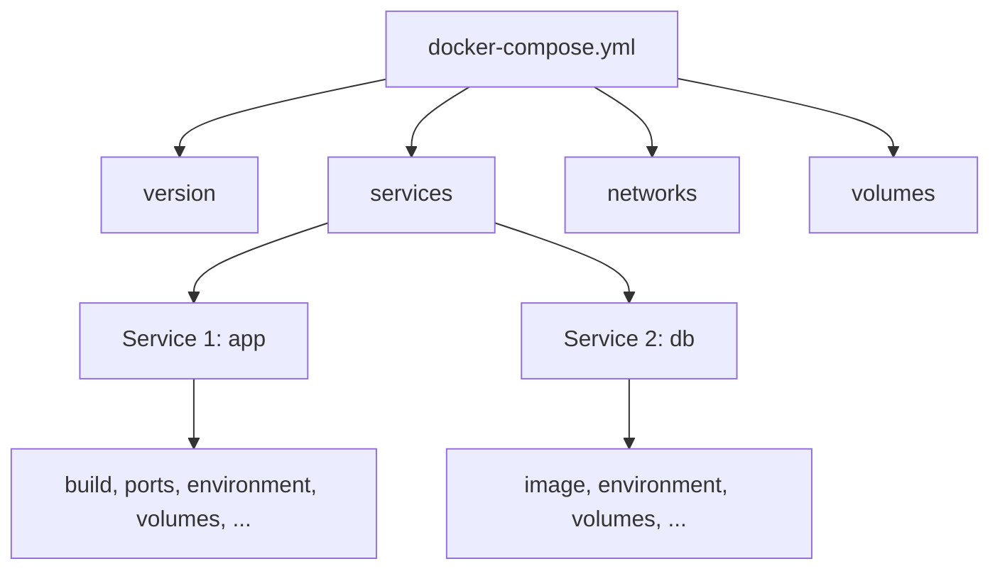
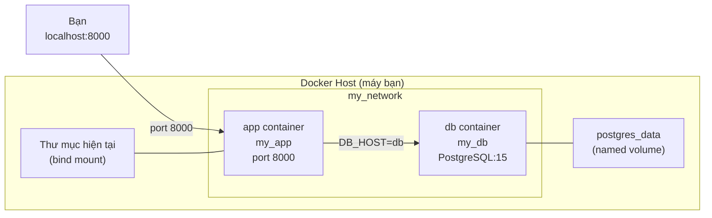
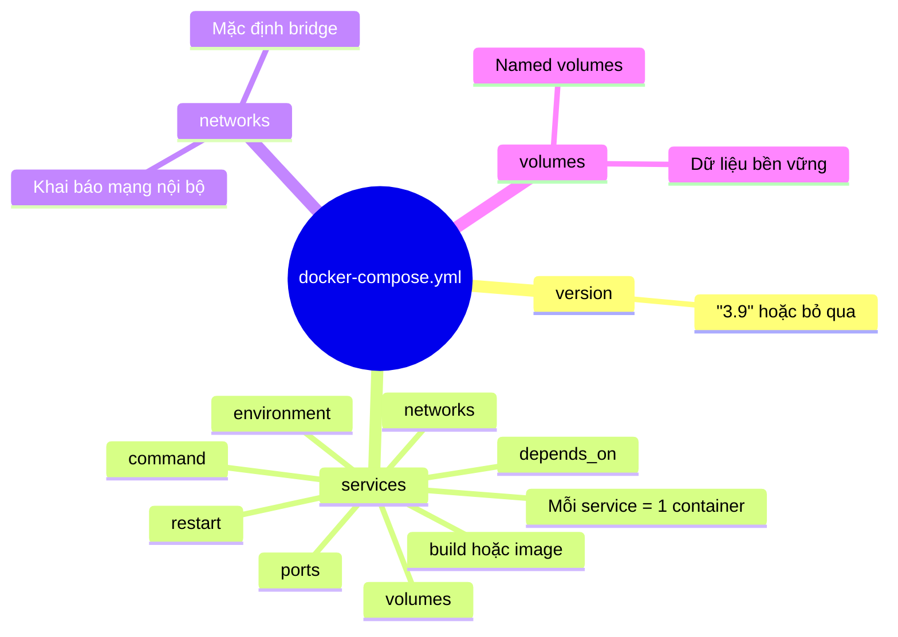

# Giải thích Docker Compose

> Claude Opus 4.6

---

## 1. Cấu trúc tổng thể của Docker Compose

Một file `docker-compose.yml` có **4 section chính** (cấp cao nhất):



| Section    | Ý nghĩa                                         |
| ---------- | ----------------------------------------------- |
| `version`  | Phiên bản cú pháp Docker Compose                |
| `services` | Khai báo các container (ứng dụng) cần chạy      |
| `networks` | Khai báo mạng nội bộ để các container giao tiếp |
| `volumes`  | Khai báo ổ đĩa lưu trữ dữ liệu bền vững         |

---

## 2. Giải thích từng dòng trong file của bạn

### 2.1. `version: "3.9"`

```yaml
version: "3.9"
```

- **Là gì?** Chỉ định phiên bản cú pháp Compose bạn đang dùng.
- **"3.9"** là phiên bản phổ biến, hỗ trợ hầu hết tính năng hiện đại.
- **Lưu ý:** Từ Docker Compose V2 trở đi, dòng này là **tùy chọn** (optional) — bạn có thể bỏ qua.

---

### 2.2. `services:` — Phần quan trọng nhất

Đây là nơi bạn khai báo **từng container** cần chạy. File của bạn có 2 services: `app` và `db`.

---

#### 🔹 Service `app` (ứng dụng Python)

```yaml
app: # Tên service (bạn tự đặt)
  build: . # Build image từ Dockerfile ở thư mục hiện tại
  container_name: my_app # Đặt tên container
  ports: # Map port
    - "8000:8000"
  depends_on: # Thứ tự khởi động
    - db
  environment: # Biến môi trường
    DB_HOST: db
    DB_USER: user
    DB_PASSWORD: pass
  volumes: # Gắn thư mục
    - .:/app
  networks: # Kết nối mạng
    - my_network
  command: python app.py # Lệnh chạy khi container start
```

Chi tiết từng thuộc tính:

| STT | Thuộc tính       | Giá trị                   | Giải thích                                                                                                                    |
| :-: | ---------------- | ------------------------- | ----------------------------------------------------------------------------------------------------------------------------- |
|  1  | `build: .`       | `.` (thư mục hiện tại)    | Docker sẽ tìm file `Dockerfile` ở thư mục hiện tại và build image từ đó. Tương đương lệnh `docker build .`                    |
|  2  | `container_name` | `my_app`                  | Đặt tên cố định cho container. Nếu không đặt, Docker tự sinh tên kiểu `docker-example-app-1`                                  |
|  3  | `ports`          | `"8000:8000"`             | Map cổng **máy host : container**. Truy cập `localhost:8000` trên máy bạn sẽ được chuyển vào port 8000 trong container        |
|  4  | `depends_on`     | `- db`                    | Container `app` sẽ **chờ** container `db` khởi động trước mới bắt đầu chạy                                                    |
|  5  | `environment`    | `DB_HOST`, `DB_USER`, ... | Truyền biến môi trường vào container. Code trong container đọc qua `os.environ["DB_HOST"]`                                    |
|  6  | `volumes`        | `.:/app`                  | **Bind mount** — gắn thư mục hiện tại (`.`) trên máy host vào `/app` trong container. Sửa code trên máy → container thấy ngay |
|  7  | `networks`       | `- my_network`            | Kết nối container vào mạng `my_network` (khai báo ở dưới)                                                                     |
|  8  | `command`        | `python app.py`           | Ghi đè lệnh `CMD` trong Dockerfile. Khi container start sẽ chạy `python app.py` thay vì lệnh mặc định                         |

> [!IMPORTANT]
> **`build` vs `image`**: Dùng `build` khi bạn có Dockerfile và muốn tự build image. Dùng `image` khi muốn dùng image có sẵn từ Docker Hub (như `postgres:15`). **Không dùng cả 2 cùng lúc** trong cùng 1 service.

---

#### 🔹 Service `db` (PostgreSQL database)

```yaml
db: # Tên service
  image: postgres:15 # Dùng image có sẵn
  container_name: my_db # Tên container
  environment: # Biến môi trường cho Postgres
    POSTGRES_USER: user
    POSTGRES_PASSWORD: pass
  volumes: # Named volume
    - postgres_data:/var/lib/postgresql/data
  networks: # Cùng mạng với app
    - my_network
```

| STT | Thuộc tính                   | Giải thích                                                                                                      |
| :-: | ---------------------------- | --------------------------------------------------------------------------------------------------------------- |
|  1  | `image: postgres:15`         | Kéo image `postgres` phiên bản `15` từ Docker Hub. Không cần Dockerfile                                         |
|  2  | `container_name: my_db`      | Đặt tên container                                                                                               |
|  3  | `environment`                | `POSTGRES_USER` và `POSTGRES_PASSWORD` là biến môi trường **bắt buộc** của image Postgres để tạo user/password  |
|  4  | `postgres_data:/var/lib/...` | **Named volume** — dữ liệu database lưu trong volume `postgres_data`. Khi container bị xóa, dữ liệu **vẫn còn** |
|  5  | `networks`                   | Cùng mạng `my_network` → `app` có thể gọi đến `db` bằng tên service                                             |

> [!TIP]
> **Tại sao `DB_HOST: db` trong service app?**  
> Khi các container cùng network, Docker tự động tạo DNS resolution. Container `app` có thể gọi container `db` bằng chính **tên service** (`db`) thay vì dùng IP address.

---

### 2.3. `networks:` — Khai báo mạng

```yaml
networks:
  my_network: # Tên mạng (bạn tự đặt)
```

- Khai báo mạng nội bộ `my_network`.
- Không cần cấu hình thêm → Docker tự tạo **bridge network** mặc định.
- Các container cùng network có thể giao tiếp qua **tên service**.

> [!NOTE]
> **Thực tế:** Nếu bạn không khai báo `networks` gì cả, Docker Compose tự động tạo 1 default network cho tất cả services. Bạn chỉ cần khai báo khi muốn **tách biệt** các nhóm container.

---

### 2.4. `volumes:` — Khai báo ổ đĩa

```yaml
volumes:
  postgres_data: # Tên volume (bạn tự đặt)
```

- Khai báo **named volume** `postgres_data`.
- Docker quản lý volume này (lưu ở `docker volume` trên máy host).
- **Mục đích:** Giữ dữ liệu database ngay cả khi container bị xóa (`docker-compose down`).

---

## 3. Hai loại Volume — Phân biệt rõ ràng

```yaml
# Bind mount (trong service app):
volumes:
  - .:/app                    # Thư mục máy host : thư mục container

# Named volume (trong service db):
volumes:
  - postgres_data:/var/lib/postgresql/data   # Tên volume : thư mục container
```

| Loại             | Cú pháp                       | Khi nào dùng                                                      |
| ---------------- | ----------------------------- | ----------------------------------------------------------------- |
| **Bind mount**   | `./path/host:/path/container` | Khi cần **đồng bộ code** giữa máy host và container (development) |
| **Named volume** | `volume_name:/path/container` | Khi cần **lưu trữ dữ liệu lâu dài** (database, file upload, ...)  |

---

## 4. Sơ đồ tổng thể — Các container kết nối như thế nào



---

## 5. Bảng tổng hợp các thuộc tính phổ biến

Đây là các thuộc tính bạn sẽ dùng thường xuyên nhất:

| Thuộc tính       | Ý nghĩa                    | Ví dụ                              |
| ---------------- | -------------------------- | ---------------------------------- |
| `image`          | Dùng image có sẵn          | `image: redis:7`                   |
| `build`          | Build từ Dockerfile        | `build: .` hoặc `build: ./backend` |
| `container_name` | Tên container              | `container_name: my_redis`         |
| `ports`          | Map port host:container    | `- "3000:3000"`                    |
| `environment`    | Biến môi trường            | `NODE_ENV: production`             |
| `env_file`       | Đọc biến từ file `.env`    | `env_file: .env`                   |
| `volumes`        | Gắn ổ đĩa                  | `- ./data:/app/data`               |
| `depends_on`     | Khởi động sau service khác | `- db`                             |
| `networks`       | Kết nối mạng               | `- backend_net`                    |
| `command`        | Ghi đè CMD                 | `command: npm start`               |
| `restart`        | Tự khởi động lại           | `restart: always`                  |
| `healthcheck`    | Kiểm tra sức khỏe          | Xem ví dụ bên dưới                 |

---

## 6. Ví dụ Web App + Redis

```yaml
# Không cần version nữa (Docker Compose V2+)

services:
  web:
    build: . # Build từ Dockerfile trong thư mục hiện tại
    container_name: flask_web
    ports:
      - "5000:5000" # Truy cập qua localhost:5000
    environment:
      REDIS_HOST: cache # Gọi service redis bằng tên "cache"
      FLASK_ENV: development
    volumes:
      - .:/app # Bind mount code để hot-reload
    depends_on:
      - cache # Chờ Redis start trước
    restart: unless-stopped # Tự restart trừ khi bạn stop thủ công

  cache:
    image: redis:7-alpine # Image nhẹ của Redis
    container_name: my_redis
    ports:
      - "6379:6379" # Cho phép truy cập Redis từ ngoài (debug)
    volumes:
      - redis_data:/data # Lưu dữ liệu Redis
    restart: always # Luôn tự restart

volumes:
  redis_data: # Khai báo named volume
```

> [!TIP]
> **Quy trình tự viết docker-compose.yml:**
>
> 1. Liệt kê các service cần chạy (web app, database, cache, ...)
> 2. Mỗi service: chọn `image` (có sẵn) hoặc `build` (tự build)
> 3. Cấu hình `ports` cho service cần truy cập từ bên ngoài
> 4. Thêm `environment` cho các biến cấu hình
> 5. Thêm `volumes` cho data cần lưu trữ hoặc code cần đồng bộ
> 6. Thêm `depends_on` nếu có thứ tự phụ thuộc
> 7. Khai báo `volumes` và `networks` ở section cuối (nếu cần)

---

## 7. Các lệnh Docker Compose thường dùng

| Lệnh                           | Chức năng                           |
| ------------------------------ | ----------------------------------- |
| `docker compose up`            | Khởi động tất cả services           |
| `docker compose up -d`         | Khởi động ở chế độ nền (detached)   |
| `docker compose up --build`    | Build lại image rồi khởi động       |
| `docker compose down`          | Dừng và xóa tất cả containers       |
| `docker compose down -v`       | Dừng, xóa containers **và volumes** |
| `docker compose ps`            | Xem trạng thái các containers       |
| `docker compose logs -f`       | Xem logs realtime                   |
| `docker compose exec app bash` | Vào shell của container `app`       |

> [!WARNING]
> `docker compose down -v` sẽ **xóa luôn named volumes** (mất dữ liệu database!). Chỉ dùng khi bạn muốn reset hoàn toàn.

---

## 8. Tóm tắt — "Bản đồ tư duy" Docker Compose


