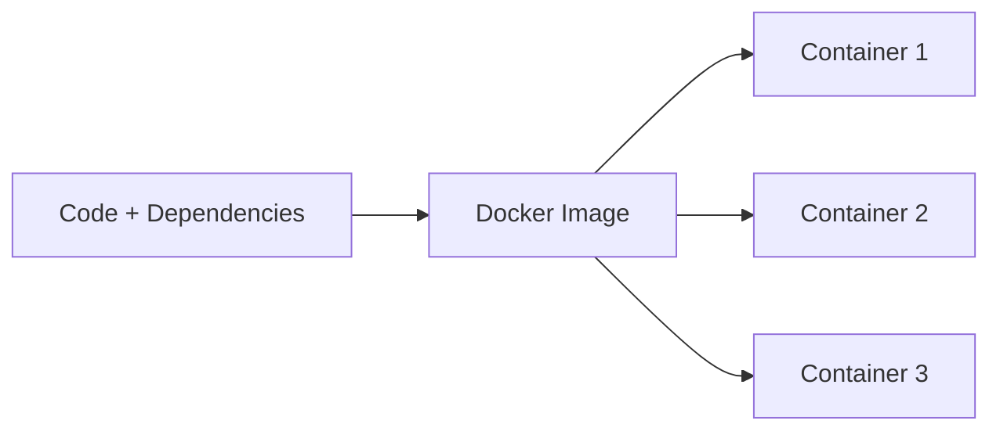
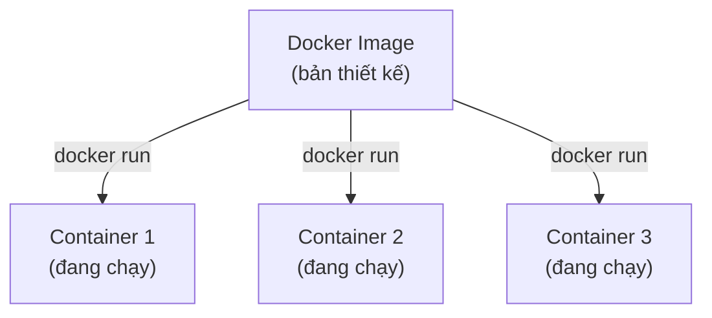
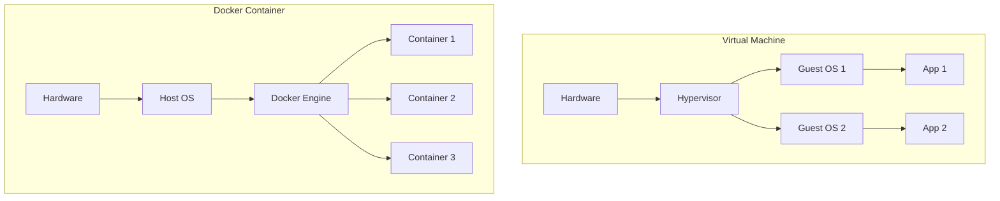
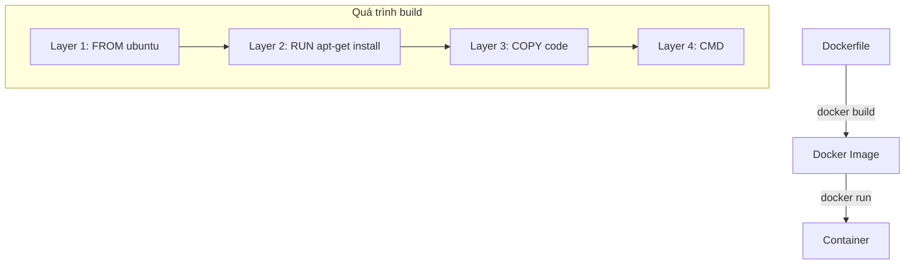
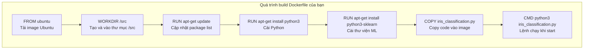
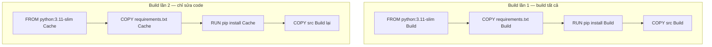
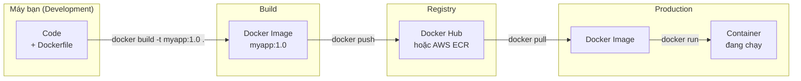
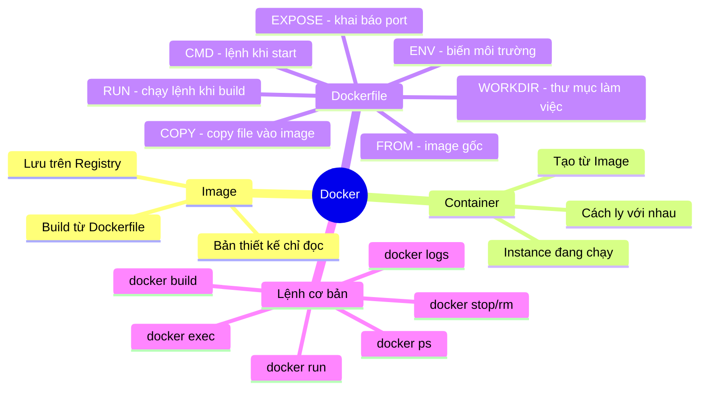

# Docker cơ bản + Dockerfile

> Claude Opus 4.6

---

## 1. Docker là gì?

Docker là nền tảng giúp bạn **đóng gói ứng dụng** cùng toàn bộ dependencies vào một đơn vị gọi là **container**, để chạy ở bất kỳ đâu một cách nhất quán.



**Vấn đề Docker giải quyết:** "Trên máy tôi chạy được mà!" — Docker loại bỏ vấn đề này bằng cách đóng gói **mọi thứ** ứng dụng cần vào một image thống nhất.

---

## 2. Các khái niệm cốt lõi

### 2.1. Image vs Container



| Khái niệm      | Giải thích                                                 | Ví dụ tương tự           |
| -------------- | ---------------------------------------------------------- | ------------------------ |
| **Image**      | Bản thiết kế chỉ đọc, chứa code + dependencies + cấu hình  | Công thức nấu ăn         |
| **Container**  | Một instance đang chạy từ image, có thể tạo/xóa/start/stop | Món ăn nấu từ công thức  |
| **Dockerfile** | File chỉ dẫn để **build** ra image                         | Hướng dẫn viết công thức |
| **Registry**   | Kho lưu trữ image (Docker Hub, AWS ECR, ...)               | App store                |

> [!TIP]
> **Một image → nhiều container.** Giống như từ 1 công thức, bạn có thể nấu ra nhiều món giống nhau.

---

### 2.2. Docker vs Virtual Machine

| Tiêu chí            | Virtual Machine  | Docker Container        |
| ------------------- | ---------------- | ----------------------- |
| Thời gian khởi động | Phút             | Giây                    |
| Kích thước          | GBs              | MBs                     |
| Tài nguyên          | Nặng (cần cả OS) | Nhẹ (dùng chung kernel) |
| Cách ly             | Toàn bộ OS       | Cấp process             |
| Số lượng trên 1 máy | Ít               | Rất nhiều               |



> [!NOTE]
> Docker container **chia sẻ kernel** với máy host → nhẹ hơn nhiều so với VM. Nhưng VM có mức cách ly cao hơn.

---

## 3. Cài đặt Docker

### Windows / macOS

1. Tải **Docker Desktop** tại https://www.docker.com/products/docker-desktop
2. Cài đặt và khởi động
3. Mở terminal, chạy:

```bash
docker run hello-world    # Kiểm tra Docker đã hoạt động
```

### Linux (Ubuntu/Debian)

```bash
# Cài đặt nhanh
curl -fsSL https://get.docker.com -o get-docker.sh
sudo sh get-docker.sh

# Cho phép chạy Docker không cần sudo
sudo usermod -aG docker $USER
newgrp docker

# Kiểm tra
docker run hello-world
```

---

## 4. Các lệnh Docker cơ bản

### 4.1. Quản lý Image

```bash
docker pull nginx:latest          # Kéo image từ Docker Hub
docker images                     # Liệt kê image trên máy
docker rmi nginx:latest           # Xóa image
docker search nginx               # Tìm image trên Docker Hub
```

### 4.2. Quản lý Container

```bash
# Tạo và chạy container
docker run -d --name webserver -p 8080:80 nginx
```

Giải thích các flag:

| Flag     | Ý nghĩa                                   | Ví dụ                 |
| -------- | ----------------------------------------- | --------------------- |
| `-d`     | Chạy nền (detached)                       | `-d`                  |
| `--name` | Đặt tên container                         | `--name webserver`    |
| `-p`     | Map port **máy host : container**         | `-p 8080:80`          |
| `-e`     | Truyền biến môi trường                    | `-e NODE_ENV=prod`    |
| `-v`     | Gắn volume/thư mục                        | `-v ./data:/app/data` |
| `-it`    | Chế độ tương tác (interactive + terminal) | `-it`                 |
| `--rm`   | Tự xóa container khi dừng                 | `--rm`                |

```bash
# Các lệnh quản lý container
docker ps                         # Xem container đang chạy
docker ps -a                      # Xem tất cả container (kể cả đã dừng)
docker stop <container>           # Dừng container
docker start <container>          # Khởi động lại container đã dừng
docker restart <container>        # Restart container
docker rm <container>             # Xóa container
docker rm $(docker ps -aq)        # Xóa tất cả container đã dừng
```

### 4.3. Kiểm tra và Debug

```bash
docker logs <container>           # Xem logs
docker logs -f <container>        # Xem logs realtime
docker logs --tail 50 <container> # Xem 50 dòng log cuối

docker exec -it <container> bash  # Vào shell của container
docker exec <container> ls /app   # Chạy lệnh trong container

docker inspect <container>        # Xem chi tiết container
docker stats <container>          # Xem tài nguyên đang dùng

docker cp file.txt <container>:/app/   # Copy file vào container
docker cp <container>:/app/data.txt .  # Copy file ra máy host
```

### 4.4. Dọn dẹp hệ thống

```bash
docker system df                  # Xem dung lượng Docker đang dùng
docker system prune               # Xóa container, image, network không dùng
docker system prune -a            # Xóa luôn image không được dùng bởi container nào
```

> [!WARNING]
> `docker system prune -a` sẽ **xóa tất cả image** không đang được dùng. Chỉ dùng khi bạn muốn giải phóng dung lượng triệt để.

---

## 5. Dockerfile — Tự build Image

### 5.1. Dockerfile là gì?

Dockerfile là file chỉ dẫn **từng bước** để Docker build ra một image. Mỗi dòng lệnh tạo ra một **layer** trong image.



---

### 5.2. Các lệnh Dockerfile cơ bản

| STT | Lệnh         | Chức năng                                | Ví dụ                            |
| :-: | ------------ | ---------------------------------------- | -------------------------------- |
|  1  | `FROM`       | Chọn image gốc (bắt buộc, dòng đầu)      | `FROM python:3.11-slim`          |
|  2  | `WORKDIR`    | Đặt thư mục làm việc trong container     | `WORKDIR /app`                   |
|  3  | `RUN`        | Chạy lệnh khi **build** image            | `RUN apt-get install -y python3` |
|  4  | `COPY`       | Copy file từ máy host vào image          | `COPY app.py ./app.py`           |
|  5  | `ADD`        | Giống COPY, thêm khả năng giải nén + URL | `ADD data.tar.gz /app/`          |
|  6  | `ENV`        | Đặt biến môi trường                      | `ENV PORT=8000`                  |
|  7  | `EXPOSE`     | Khai báo port ứng dụng sử dụng           | `EXPOSE 8000`                    |
|  8  | `CMD`        | Lệnh mặc định khi container **start**    | `CMD ["python3", "app.py"]`      |
|  9  | `ENTRYPOINT` | Giống CMD nhưng không bị ghi đè dễ dàng  | `ENTRYPOINT ["python3"]`         |

> [!IMPORTANT]
> **`RUN` vs `CMD`:**
>
> - `RUN` chạy khi **build image** (cài đặt packages, tạo thư mục, ...)
> - `CMD` chạy khi **container start** (khởi động ứng dụng)
>
> **`COPY` vs `ADD`:**
>
> - `COPY` chỉ copy file — **nên dùng mặc định**
> - `ADD` thêm khả năng tự giải nén `.tar.gz` và tải từ URL — chỉ dùng khi cần tính năng này

---

### 5.3. Giải thích Dockerfile ví dụ

Đây là file `Dockerfile` trong thư mục `docker-example` của bạn:

```dockerfile
# image base mà Dockerfile sẽ build theo
FROM ubuntu

# working directory
WORKDIR /src

# install python
RUN apt-get update
RUN apt-get -y install python3

# install python libraries
RUN apt-get -y install python3-sklearn

# copy python file
COPY iris_classification.py ./iris_classification.py

# run python file
CMD ["python3", "iris_classification.py"]
```

Giải thích từng dòng:

| STT | Dòng lệnh                                     | Giải thích                                                             |
| :-: | --------------------------------------------- | ---------------------------------------------------------------------- |
|  1  | `FROM ubuntu`                                 | Dùng image **Ubuntu** làm nền. Container sẽ có môi trường Ubuntu       |
|  2  | `WORKDIR /src`                                | Đặt thư mục làm việc là `/src`. Các lệnh sau sẽ chạy ở đây             |
|  3  | `RUN apt-get update`                          | Cập nhật danh sách package của Ubuntu                                  |
|  4  | `RUN apt-get -y install python3`              | Cài Python 3. Flag `-y` tự động trả lời "yes" khi được hỏi             |
|  5  | `RUN apt-get -y install python3-sklearn`      | Cài thư viện scikit-learn cho Python                                   |
|  6  | `COPY iris_classification.py ./iris_class...` | Copy file `iris_classification.py` từ máy host vào `/src/` trong image |
|  7  | `CMD ["python3", "iris_classification.py"]`   | Khi container start → chạy `python3 iris_classification.py`            |



---

### 5.4. Build và chạy Image

```bash
# Build image từ Dockerfile (ở thư mục chứa Dockerfile)
docker build -t iris-app:1.0 .        # -t đặt tên:tag, dấu . là thư mục hiện tại

# Chạy container từ image vừa build
docker run iris-app:1.0

# Chạy ở chế độ nền
docker run -d --name my_iris iris-app:1.0

# Xem logs
docker logs my_iris

# Build với Dockerfile ở vị trí khác
docker build -t myapp:1.0 -f path/to/Dockerfile .

# Xem lịch sử các layer của image
docker history iris-app:1.0

# Xem kích thước image
docker images iris-app:1.0
```

> [!TIP]
> **Dấu `.` cuối lệnh `docker build`** là **build context** — thư mục mà Docker sẽ dùng để tìm file khi gặp lệnh `COPY` hoặc `ADD`.

---

### 5.5. Viết Dockerfile tốt hơn — Best Practices

#### Cách viết chưa tối ưu (Dockerfile ví dụ của bạn)

```dockerfile
FROM ubuntu                               # Không chỉ định version
RUN apt-get update                        # Tách thành 2 lệnh RUN
RUN apt-get -y install python3
RUN apt-get -y install python3-sklearn    # Thêm 1 lệnh RUN nữa
COPY iris_classification.py ./iris_classification.py
CMD ["python3", "iris_classification.py"]
```

#### Cách viết tối ưu hơn

```dockerfile
# Chỉ định version cụ thể
FROM ubuntu:22.04

WORKDIR /src

# Gộp các lệnh RUN lại → giảm số layer → image nhỏ hơn
RUN apt-get update && apt-get -y install \
    python3 \
    python3-sklearn \
    && rm -rf /var/lib/apt/lists/*

COPY iris_classification.py ./iris_classification.py

CMD ["python3", "iris_classification.py"]
```

Các nguyên tắc:

| STT | Nguyên tắc                                 | Lý do                                                              |
| :-: | ------------------------------------------ | ------------------------------------------------------------------ |
|  1  | Chỉ định **version cụ thể** của base image | `FROM ubuntu:22.04` thay vì `FROM ubuntu` — tránh breaking changes |
|  2  | **Gộp các lệnh RUN** bằng `&&`             | Mỗi `RUN` tạo 1 layer → ít layer hơn = image nhỏ hơn               |
|  3  | **Xóa cache** sau khi cài package          | `rm -rf /var/lib/apt/lists/*` giảm kích thước image                |
|  4  | **Copy file ít thay đổi trước**            | Docker cache layer — file thay đổi nhiều đặt cuối                  |
|  5  | Dùng image **slim/alpine** khi có thể      | `python:3.11-slim` nhỏ hơn nhiều so với `python:3.11`              |

---

### 5.6. Thứ tự Layer — Tại sao quan trọng?

Docker **cache** từng layer. Khi build lại, nếu một layer không thay đổi → Docker dùng cache (nhanh hơn).

```dockerfile
FROM python:3.11-slim
WORKDIR /app

# Layer ít thay đổi → đặt trước
COPY requirements.txt .
RUN pip install --no-cache-dir -r requirements.txt

# Layer thay đổi thường xuyên → đặt sau
COPY src ./src

CMD ["python", "src/main.py"]
```



> [!NOTE]
> Khi bạn chỉ sửa code trong `src/` → Docker dùng cache cho 3 layer đầu, chỉ build lại layer `COPY src` → **build rất nhanh**.

---

### 5.7. File `.dockerignore`

Giống `.gitignore`, file `.dockerignore` cho Docker biết **không copy** những file/thư mục nào vào build context.

Tạo file `.dockerignore` cùng thư mục với `Dockerfile`:

```
# Không copy những thứ này vào image
node_modules
.git
.env
*.pyc
__pycache__
.vscode
*.md
```

> [!TIP]
> Không có `.dockerignore` → Docker sẽ copy **toàn bộ thư mục** (kể cả `.git`, `node_modules`) vào build context → build chậm và image nặng.

---

## 6. Ví dụ Dockerfile cho Data Engineering

### PySpark

```dockerfile
# Dùng image chính thức của Apache Spark (đã có Java + Spark)
FROM apache/spark-py:3.5.1

USER root
WORKDIR /app

# Cài thêm thư viện Python cho Data Engineering
COPY requirements.txt .
RUN pip install --no-cache-dir -r requirements.txt

# Copy code PySpark
COPY jobs ./jobs
COPY data ./data

USER spark

# Chạy Spark job
CMD ["spark-submit", "--master", "local[*]", "jobs/etl_pipeline.py"]
```

> [!NOTE]
> Image `apache/spark-py` đã bao gồm Java, Spark, và PySpark. Bạn chỉ cần cài thêm thư viện Python bổ sung (pandas, delta-spark, ...).

---

### Streamlit (Data Dashboard)

```dockerfile
FROM python:3.11-slim

WORKDIR /app

# Cài dependencies trước (cache layer)
COPY requirements.txt .
RUN pip install --no-cache-dir -r requirements.txt

# Copy code dashboard
COPY app.py .
COPY pages ./pages
COPY data ./data

# Streamlit mặc định chạy trên port 8501
EXPOSE 8501

# Tắt telemetry + cho phép truy cập từ bên ngoài container
CMD ["streamlit", "run", "app.py", \
     "--server.address=0.0.0.0", \
     "--server.headless=true"]
```

> [!TIP]
> Flag `--server.headless=true` ngăn Streamlit mở trình duyệt tự động trong container (vì container không có GUI).

---

### Kafka (sử dụng image có sẵn)

Kafka thường **không cần viết Dockerfile** — dùng image có sẵn trong `docker-compose.yml`:

```yaml
services:
  zookeeper:
    image: confluentinc/cp-zookeeper:7.5.0     # Kafka cần Zookeeper để quản lý
    environment:
      ZOOKEEPER_CLIENT_PORT: 2181

  kafka:
    image: confluentinc/cp-kafka:7.5.0         # Image Kafka từ Confluent
    ports:
      - "9092:9092"
    environment:
      KAFKA_BROKER_ID: 1
      KAFKA_ZOOKEEPER_CONNECT: zookeeper:2181  # Kết nối đến Zookeeper bằng tên service
      KAFKA_ADVERTISED_LISTENERS: PLAINTEXT://localhost:9092
      KAFKA_OFFSETS_TOPIC_REPLICATION_FACTOR: 1
    depends_on:
      - zookeeper
```

Nhưng nếu bạn cần **Kafka Producer/Consumer bằng Python**, viết Dockerfile riêng:

```dockerfile
FROM python:3.11-slim

WORKDIR /app

COPY requirements.txt .
RUN pip install --no-cache-dir -r requirements.txt
# requirements.txt chứa: confluent-kafka hoặc kafka-python

COPY producer.py .
COPY consumer.py .

CMD ["python", "producer.py"]
```

---

### Airflow (sử dụng image có sẵn)

Airflow cũng thường dùng image có sẵn, mở rộng bằng Dockerfile khi cần cài thêm thư viện:

```dockerfile
# Mở rộng từ image chính thức của Airflow
FROM apache/airflow:2.8.1-python3.11

# Cài thêm providers và thư viện cho pipeline
RUN pip install --no-cache-dir \
    apache-airflow-providers-postgres \
    apache-airflow-providers-amazon \
    pandas \
    sqlalchemy

# Copy các DAGs vào thư mục Airflow
COPY dags ./dags
COPY plugins ./plugins
```

> [!IMPORTANT]
> Với Airflow, bạn **không cần khai báo CMD** — image gốc đã có sẵn entrypoint để chạy webserver, scheduler, hoặc worker tùy theo cấu hình trong `docker-compose.yml`.

---

## 7. Sơ đồ tổng thể — Từ code đến container



---

## 8. Các lệnh Docker thường dùng

### Image

| Lệnh                         | Chức năng                 |
| ---------------------------- | ------------------------- |
| `docker build -t name:tag .` | Build image từ Dockerfile |
| `docker images`              | Liệt kê images            |
| `docker pull image:tag`      | Kéo image từ registry     |
| `docker rmi image:tag`       | Xóa image                 |
| `docker history image:tag`   | Xem các layer của image   |

### Container

| Lệnh                               | Chức năng                   |
| ---------------------------------- | --------------------------- |
| `docker run -d -p 8080:80 image`   | Tạo và chạy container       |
| `docker ps`                        | Xem container đang chạy     |
| `docker ps -a`                     | Xem tất cả container        |
| `docker stop <container>`          | Dừng container              |
| `docker start <container>`         | Khởi động container đã dừng |
| `docker rm <container>`            | Xóa container               |
| `docker logs -f <container>`       | Xem logs realtime           |
| `docker exec -it <container> bash` | Vào shell của container     |

### Hệ thống

| Lệnh                  | Chức năng                           |
| --------------------- | ----------------------------------- |
| `docker system df`    | Xem dung lượng Docker đang dùng     |
| `docker system prune` | Dọn dẹp container, image không dùng |
| `docker version`      | Xem phiên bản Docker                |

---

## 9. Tóm tắt — "Bản đồ tư duy" Docker cơ bản


